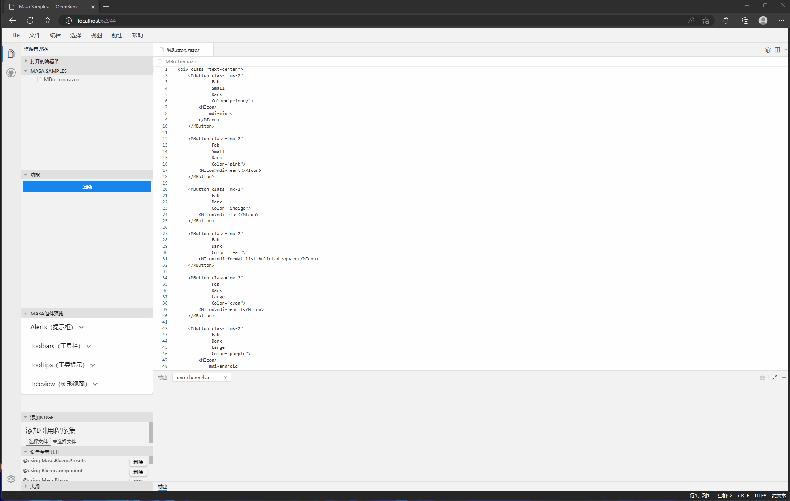

# MASA.Code

目前支持Blazor razor组件动态渲染
如果你想修改vscode的相关界面 请前往web下的项目 

## 准备前端项目环境

1. 安装依赖

```shell
yarn
```

2. 启动前端项目

```shell
yarn start
```

## 对于前端节目的修改

如果您想对于Ide的界面修改的话请参考 [OpenSumi](https://opensumi.com/zh)
当前项目的Ide完全是由 OpenSumi构建完成

## 渲染逻辑

项目动态编译是由 [MASA.Blazor.Extensions](https://github.com/BlazorComponent/MASA.Blazor.Extensions) 提供支持
动态渲染由 `DynamicComponent ` 实现 ,先由 `MASA.Blazor.Extensions` 将 `Code` 部分编译成程序集 在程序集中获取到对应的 `Type` 将 `Type` 传入`DynamicComponent` 实现动态渲染
动态编译注意事项请留意 [MASA.Blazor.Extensions](https://github.com/BlazorComponent/MASA.Blazor.Extensions)

## 使用MASA.Code的功能

// 添加引用
```csharp
builder.Services.AddMasaCodeShared();
```

// 将ServiceProvider传递进去
```csharp
app.Services.UseServiceProvider();
```

## 如何调试

由于ide 和 webassembly是独立的俩个项目，无法一块运行，所以在调试的时候较困难，可以使用nginx代理，将前端和webassembly项目代理到一个端口，可以使用nginx文件夹下面的docker-compose运行，如果有必要可以修改端口 run起来以后访问`http://localhost:8808/` 查看效果，需要将前端项目和web assembly俩个项目运行起来！

## 效果预览：




## 演示地址

[进入](http://masa.tokengo.top:81/)
